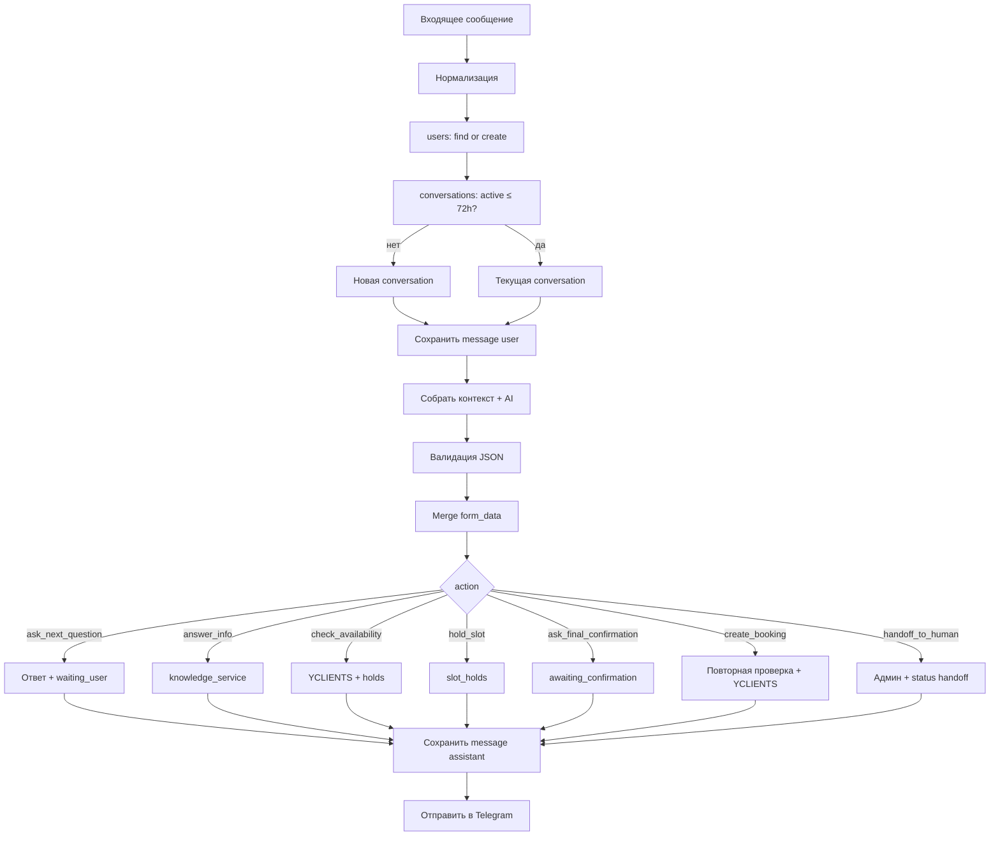

# План разработки: AI-автоадминистратор бронирования

> Документ для пошаговой работы. Обновлять по мере выполнения этапов (ставить `[x]` в чеклистах).
>
> Источники: устное ТЗ (логика n8n), файл `tz.md`, [документация YCLIENTS](https://developers.yclients.com/ru/).

---

## 1. Сводный анализ

### 1.1. Что вы описали (ядро логики)

| Шаг | Суть |
|-----|------|
| Вход | Telegram → `external_id`, имя, текст, время |
| Пользователь | Таблица `users`: найти или создать по `channel + external_id` |
| Сессия | Таблица `conversations`: активная сессия ≤ 72 ч, иначе новая |
| Память | Таблица `messages`: история по `conversation_id` |
| AI | Понимает intent, обновляет `form_data`, задаёт вопросы по анкете |
| Ветки | `booking` / проверка слотов / `info` из MD / `other` |
| Финал | Полная анкета → резерв слота → подтверждение → бронь в YCLIENTS |
| Конфиг | Секреты в `.env`, вопросы и промпты в файлах (MD + YAML) |

Это правильная основа. Проект — **не n8n**, а **Python-оркестратор + markdown/yaml-конфиг + MySQL на Beget**.

### 1.2. Что добавляет и исправляет `tz.md`

| Проблема в исходной логике | Решение в проекте |
|----------------------------|-------------------|
| `intent` смешан с действием системы | Разделить **`intent`** (что хочет клиент) и **`action`** (что делает код) |
| Опечатки в полях БД | `external_id`, `last_seen_at`, `next_step`, `conversation` |
| Только `active/inactive` у сессии | Расширенные статусы: `waiting_user`, `awaiting_confirmation`, `booked`, … |
| Нет защиты от двух клиентов на один слот | Таблица **`slot_holds`** (резерв 10–15 мин) |
| Бронь сразу после анкеты | Шаг **`awaiting_final_confirmation`** + повторная проверка YCLIENTS |
| Вопросы только в MD | **MD для людей/AI** + **`config/booking_form.yaml` для кода** |
| Нет очереди броней | Таблица **`bookings`** + позже воркер/триггер (этап 2) |
| Оплата неясна | Отдельный этап после MVP, поля `payment_status` заложить сразу |

### 1.3. Архитектурный принцип (не нарушать)

```
Клиент → Telegram/MAX → Python (процесс) → AI (JSON) → Python (действия) → YCLIENTS / БД
```

- **AI** — понимание текста, извлечение полей, короткий ответ клиенту.
- **Python** — пользователи, сессии, TTL, API YCLIENTS, holds, бронь, логи, handoff.
- **YCLIENTS** — источник правды по расписанию и финальной записи.
- **БД** — пользователи, диалоги, сообщения, резервы, брони, логи.

---

## 2. Структура репозитория (целевая)

```text
best/
  .env                    # локально, НЕ в git
  .env.example            # шаблон, в git
  .gitignore
  README.md
  requirements.txt
  main.py                 # точка входа (polling / webhook)

  PLAN.md                 # этот файл
  tz.md                   # полное ТЗ

  app/
    bot/
      telegram_bot.py
      max_bot.py          # этап 2
      router.py           # единый формат входящего сообщения

    core/
      config.py
      logger.py
      constants.py
      validators.py
      time_utils.py

    db/
      connection.py
      migrations/
        001_init.sql
      repositories/
        users_repo.py
        conversations_repo.py
        messages_repo.py
        slot_holds_repo.py
        bookings_repo.py
        logs_repo.py

    ai/
      openai_client.py
      prompt_loader.py
      ai_orchestrator.py
      schemas.py          # Pydantic-модель ответа AI

    services/
      conversation_service.py
      message_service.py
      booking_form_service.py
      availability_service.py
      hold_service.py
      booking_service.py
      knowledge_service.py
      handoff_service.py

    integrations/
      yclients_client.py
      telegram_client.py

    prompts/              # каждый промпт — отдельный .md
      system_prompt.md
      intent_classifier.md
      booking_dialog.md
      info_answer.md
      response_generator.md
      handoff_rules.md
      json_repair.md      # повтор при битом JSON

    knowledge/            # база знаний (из docx → md)
      company.md
      objects.md
      prices.md
      rules.md
      faq.md

  config/
    booking_form.yaml     # машинная анкета
    services_map.yaml     # наш объект → yclients_service_id
    channels.yaml         # telegram, max, vk

  docs/
    booking_questions.md  # человекочитаемая анкета (как вы писали)

  tests/
    ...
```

---

## 3. Переменные `.env` — что нужно подготовить

Создать локально `.env` по шаблону `.env.example`. **В git только `.env.example`.**

### 3.1. Обязательно для этапа 1 (Telegram + БД + AI)

| Переменная | Откуда взять | Зачем |
|------------|--------------|-------|
| `APP_ENV` | `local` / `production` | Режим |
| `APP_TIMEZONE` | `Europe/Moscow` | Даты «завтра», «в субботу» |
| `SESSION_TTL_HOURS` | `72` | Новая conversation после простоя |
| `HOLD_TTL_MINUTES` | `15` (уточнить) | Временный резерв слота |
| `DB_HOST` | Панель Beget → MySQL | Хост БД |
| `DB_PORT` | Обычно `3306` | Порт |
| `DB_NAME` | Имя базы в Beget | |
| `DB_USER` | Пользователь БД | |
| `DB_PASSWORD` | Пароль БД | |
| `DB_CHARSET` | `utf8mb4` | Кириллица в JSON/тексте |
| `TELEGRAM_BOT_TOKEN` | [@BotFather](https://t.me/BotFather) | Бот |
| `OPENAI_API_KEY` | OpenAI / совместимый API | AI |
| `OPENAI_MODEL` | напр. `gpt-4.1-mini` | Модель |
| `OPENAI_TEMPERATURE` | `0.2` | Стабильный JSON |
| `ADMIN_TELEGRAM_CHAT_ID` | Ваш chat id | Ошибки и handoff |
| `LOG_LEVEL` | `INFO` | Логи |

### 3.2. Для этапа YCLIENTS (после MVP-диалога)

| Переменная | Откуда | Зачем |
|------------|--------|-------|
| `YCLIENTS_BASE_URL` | `https://api.yclients.com/api/v1` | API |
| `YCLIENTS_PARTNER_TOKEN` | [Маркетплейс интеграций](https://yclients.com/appstore/developers) | `Authorization: Bearer` |
| `YCLIENTS_USER_TOKEN` | `POST /api/v1/auth` | Доступ к записи компании |
| `YCLIENTS_COMPANY_ID` | Настройки филиала | ID компании |

Заголовки API (жёстко в клиенте, не в .env):

- `Accept: application/vnd.yclients.v2+json`
- `Authorization: Bearer <partner>, User <user>`

### 3.3. Позже (не блокируют старт)

| Переменная | Когда |
|------------|-------|
| `MAX_BOT_TOKEN`, `MAX_WEBHOOK_SECRET` | Канал MAX |
| `VK_*` | ВКонтакте |
| `PAYMENT_*` | После решения по предоплате |
| `TELEGRAM_WEBHOOK_URL` | Если webhook вместо polling |

### 3.4. Чеклист перед кодом

- [ ] База создана в Beget (уточнить: **MySQL** — по умолчанию на Beget)
- [ ] Пользователь БД имеет права на CREATE TABLE (или выполнить миграцию вручную в phpMyAdmin)
- [ ] Токен Telegram-бота получен
- [ ] API-ключ OpenAI (или аналог)
- [ ] `ADMIN_TELEGRAM_CHAT_ID` — узнать через `@userinfobot` или лог входящего update
- [ ] YCLIENTS: partner token + user token + company_id (можно отложить до этапа 7)

---

## 4. База данных — схема и роли таблиц

Выполнить `app/db/migrations/001_init.sql` на Beget.

| Таблица | Назначение |
|---------|------------|
| `users` | Клиент: `channel` + `external_id`, имя, телефон, `last_seen_at` |
| `conversations` | Сессия диалога: `intent`, `current_step`, `next_step`, `status`, `form_data` (JSON), `last_message_time` |
| `messages` | История: `sender` = user \| assistant \| system \| admin |
| `slot_holds` | Временный резерв даты/времени/объекта |
| `bookings` | Очередь/журнал броней перед и после YCLIENTS |
| `system_logs` | Ошибки AI, API, handoff |

### 4.1. `users` — уточнение к вашему описанию

- Добавить **`channel`** (`telegram`, потом `max`) — один человек в разных мессенджерах = разные `external_id`, но можно связать позже по телефону.
- **`external_id`** вместо `externed_id`.
- **`last_seen_at`** вместо `lfst_seen_at`.

### 4.2. `conversations` — статусы

Рекомендуемые значения `status`:

- `active` — диалог идёт
- `waiting_user` — бот задал вопрос
- `checking_availability` — запрос к YCLIENTS
- `awaiting_confirmation` — слот найден, ждём «да»
- `booking_in_progress` — создаётся запись
- `booked` — успех
- `expired` — > 72 ч без активности
- `cancelled` — клиент отказался
- `handoff` — передано админу
- `error` — техническая ошибка

### 4.3. `form_data` — начальное состояние

```json
{
  "date": null,
  "time": null,
  "duration": null,
  "phone": null,
  "client_name": null,
  "preferences": null,
  "event_format": null,
  "guests_count": null,
  "service_type": null,
  "upsell_items": [],
  "comment": null,
  "payment_status": "not_required_yet"
}
```

`next_step` считает **Python** (`booking_form_service`), не AI — по пустым обязательным полям из YAML.

### 4.4. Intent и Action (финальная модель)

**Intent** (что хочет клиент):

- `booking_request`
- `availability_question`
- `price_question`
- `object_selection_help`
- `company_info`
- `change_booking` / `cancel_booking`
- `payment_question`
- `human_request`
- `other`

**Action** (что выполняет код после AI):

- `ask_next_question`
- `answer_info`
- `check_availability`
- `offer_slots`
- `hold_slot`
- `ask_final_confirmation`
- `create_booking`
- `handoff_to_human`
- `reset_conversation`
- `send_error_message`

Пример: клиент пишет «баня 17 мая» → `intent: availability_question` или `booking_request`, **`action: check_availability`**.

---

## 5. Файлы конфигурации и промптов

### 5.1. Анкета: MD + YAML (оба нужны)

| Файл | Для кого | Содержание |
|------|----------|------------|
| `docs/booking_questions.md` | Вы, AI (контекст) | Текст вопросов как в n8n, можно править без кода |
| `config/booking_form.yaml` | Python | `key`, `label`, `required_for_availability`, `required_for_booking`, `type`, `allowed_values` |

Порядок вопросов и обязательность — **только из YAML**. MD — справочник для промпта `booking_dialog.md`.

### 5.2. Промпты — один файл = одна роль

| Файл | Задача |
|------|--------|
| `system_prompt.md` | Роль, запреты (не бронировать самому, не выдумывать цены), только JSON |
| `intent_classifier.md` | Правила intent / action / changed_fields |
| `booking_dialog.md` | Один вопрос за раз, не дублировать заполненное |
| `info_answer.md` | Ответ только из `knowledge/*.md` |
| `response_generator.md` | Тон, краткость, русский язык |
| `handoff_rules.md` | Когда `handoff_to_human: true` |
| `json_repair.md` | Повтор при невалидном JSON |

Сборка контекста в `prompt_loader.py`: system + нужные блоки + история + `form_data` + фрагмент knowledge.

### 5.3. База знаний

| Файл | Источник |
|------|----------|
| `knowledge/company.md` | Из `Инструкция для администратора.docx` → переписать в MD |
| `knowledge/objects.md` | Описание бань, беседок, домиков (после выгрузки услуг из YCLIENTS) |
| `knowledge/prices.md` | Прайс (пока MD, позже можно БД/таблица) |
| `knowledge/rules.md` | Правила базы, отмена, депозит |
| `knowledge/faq.md` | Частые вопросы |

### 5.4. `config/services_map.yaml`

Сопоставление ваших типов с YCLIENTS (заполнить после `get_services`):

```yaml
bathhouse:
  title: "Баня"
  yclients_service_id: "TBD"
  default_duration_minutes: 120
# summer_gazebo, warm_gazebo, house, gazebo_bathhouse ...
```

---

## 6. Алгоритм обработки сообщения (эталон)



### 6.1. Первое сообщение

1. Создать `user`.
2. Создать `conversation` с пустым `form_data`.
3. Сохранить сообщение пользователя.
4. AI → intent/action/patch.
5. Если есть `service_type` + `date` → `check_availability` (когда YCLIENTS подключён).
6. Иначе → `ask_next_question` по первому пустому полю YAML.
7. Сохранить ответ ассистента.

### 6.2. Следующие сообщения

1. Обновить `last_seen_at` у user.
2. Найти conversation: `status IN (active, waiting_user, awaiting_confirmation, checking_availability)` AND `last_message_time` within 72h.
3. Подтянуть последние N сообщений (например 20).
4. Тот же pipeline + merge `form_data_patch`.
5. При смене date/time/service_type → **отменить старый hold**.

### 6.3. Когда анкета полная

1. `check_availability` / `offer_slots` уже были.
2. `hold_slot` при выборе конкретного времени.
3. `ask_final_confirmation` — текст с итогом.
4. Клиент: «да» / «подтверждаю» → `create_booking`.
5. Запись в `bookings`, вызов YCLIENTS, `conversation.status = booked`.
6. Уведомление `ADMIN_TELEGRAM_CHAT_ID`.

### 6.4. Резерв слота (ваше требование)

Как только клиент зафиксировал **объект + дату + время** и слот свободен в YCLIENTS и нет чужого `slot_holds`:

1. INSERT `slot_holds` (`expires_at = now + HOLD_TTL_MINUTES`).
2. Другим сессиям этот слот **не предлагать** (проверка в `availability_service`).
3. При истечении TTL → `expired`, при подтверждении брони → `converted`.

---

## 7. JSON-ответ AI (контракт)

AI возвращает **только JSON** (без markdown-обёртки). Схема — в `app/ai/schemas.py` (Pydantic).

Ключевые поля:

- `intent`, `confidence`, `action`
- `current_step`, `next_step`
- `changed_fields`, `form_data_patch`, `missing_fields`
- `reply_to_user`
- `handoff_to_human`, `handoff_reason`

При `confidence < 0.75` на критичных шагах → уточнение или handoff.

При невалидном JSON → 1 повтор с `json_repair.md` → иначе handoff.

---

## 8. YCLIENTS — этап интеграции

### 8.1. Минимальные методы клиента

- `get_services()` — список услуг компании
- `get_staff()` / ресурсы — если записи привязаны к сотруднику/ресурсу
- `check_available_slots(service_id, date)` — свободное время
- `create_record(payload)` — создание записи
- `cancel_record(record_id)` — отмена

Точные URL и body — сверять с [документацией](https://developers.yclients.com/ru/) при реализации (раздел «Онлайн-запись», записи, расписание).

### 8.2. Порядок настройки

1. Авторизация partner + user token.
2. Выгрузить услуги → заполнить `services_map.yaml`.
3. Описать объекты в `knowledge/objects.md`.
4. Тест: свободные слоты на конкретную дату.
5. Тест: создание тестовой записи (отменить вручную).

### 8.3. Оплата (после MVP)

Варианты на обсуждение:

- Предоплата в YCLIENTS (если включена в виджете/API).
- Внешний эквайринг + `payment_status` в `bookings`.
- Бронь без оплаты, оплата на месте.

До решения: `payment_status: not_required_yet` в `form_data` и `bookings`.

### 8.4. «Просмотрщик» новой таблицы броней

Ваша идея с отдельной таблицей и воркером — **этап 1.5 / 2**:

- MVP: `booking_service.create_booking()` синхронно после подтверждения.
- Позже: статус `bookings.status = pending` → фоновый процесс/cron забирает строки → YCLIENTS → `completed` / `failed`.

---

## 9. Этапы разработки (подробно)

### Этап 0 — Подготовка (вы + инфраструктура)

**Цель:** всё готово к коду.

- [ ] Создать БД на Beget, записать доступы в `.env`
- [ ] Создать бота Telegram, токен в `.env`
- [ ] Получить OpenAI API key
- [ ] Узнать `ADMIN_TELEGRAM_CHAT_ID`
- [ ] Решить: polling (проще для dev) или webhook
- [ ] Перенести `Инструкция для администратора.docx` → `knowledge/company.md` (черновик)

**Результат:** заполненный `.env`, пустой репозиторий готов к этапу 1.

---

### Этап 1 — Каркас проекта

**Цель:** запускается `python main.py`, читается config, пишутся логи.

- [ ] Структура папок по разделу 2
- [ ] `requirements.txt`: aiogram 3.x (или python-telegram-bot), sqlalchemy/pymysql, pydantic, python-dotenv, openai, pyyaml, httpx
- [ ] `.env.example`, `.gitignore` (`.env`, `__pycache__`, `.venv`)
- [ ] `app/core/config.py` — загрузка env
- [ ] `app/core/logger.py`
- [ ] `main.py` — заглушка «бот стартовал»

**Критерий готовности:** `python main.py` без ошибок, в логе виден config (без секретов).

---

### Этап 2 — База данных

**Цель:** таблицы на Beget, репозитории работают.

- [ ] `001_init.sql` — все 6 таблиц
- [ ] `connection.py` — пул соединений MySQL
- [ ] Repositories: CRUD для users, conversations, messages
- [ ] Скрипт/команда проверки: insert user + conversation + message

**Критерий готовности:** тестовая запись в БД из Python.

---

### Этап 3 — Telegram (без AI)

**Цель:** echo + сохранение в БД.

- [ ] `telegram_bot.py` — long polling
- [ ] `router.py` — нормализация входа:

```json
{
  "channel": "telegram",
  "external_user_id": "...",
  "user_name": "...",
  "text": "...",
  "message_time": "ISO8601",
  "raw_payload": {}
}
```

- [ ] find/create user
- [ ] find/create conversation (пока всегда новая или простое правило 72h)
- [ ] save user message
- [ ] ответ-заглушка «Принял: …»

**Критерий готовности:** переписка в Telegram отражается в `users`, `conversations`, `messages`.

---

### Этап 4 — Conversation engine

**Цель:** правильные сессии и история.

- [ ] Поиск активной conversation (статусы + 72h)
- [ ] Создание новой при истечении
- [ ] Обновление `last_message_time`, `last_seen_at`
- [ ] Загрузка последних N messages для контекста
- [ ] `booking_form_service`: missing fields, next field из YAML

**Критерий готовности:** второе сообщение в течение 72h продолжает ту же `conversation_id`.

---

### Этап 5 — AI-слой (без YCLIENTS)

**Цель:** бот ведёт анкету по JSON.

- [ ] Все файлы в `app/prompts/`
- [ ] `docs/booking_questions.md` + `config/booking_form.yaml`
- [ ] `prompt_loader.py`, `ai_orchestrator.py`, `schemas.py`
- [ ] Вызов OpenAI, парсинг JSON, repair
- [ ] merge `form_data_patch` → UPDATE conversation
- [ ] action `ask_next_question` / `answer_info` (info без YCLIENTS — только knowledge)
- [ ] Сохранение ответа assistant в messages

**Критерий готовности:** диалог «хочу баню» → бот задаёт вопросы по анкете, поля появляются в `form_data` в БД.

---

### Этап 6 — База знаний INFO

**Цель:** ответы о компании без выдумок.

- [ ] `knowledge/*.md` — минимум company + faq
- [ ] `knowledge_service.py` — подмешивание релевантных кусков в промпт
- [ ] `info_answer.md` + action `answer_info`
- [ ] Handoff если ответа нет в knowledge

**Критерий готовности:** вопрос «где вы находитесь» → ответ из MD, запись в messages.

---

### Этап 7 — YCLIENTS: справочники и доступность

**Цель:** реальные свободные слоты.

- [ ] `yclients_client.py` + авторизация
- [ ] Скрипт выгрузки услуг → заполнение `services_map.yaml`
- [ ] `knowledge/objects.md` по каждому объекту
- [ ] `availability_service.py` — check + учёт `slot_holds`
- [ ] action `check_availability`, `offer_slots`
- [ ] Ответ клиенту только после данных API (AI формулирует текст по факту слотов)

**Критерий готовности:** «баня 17 мая» → список свободных времён из API.

---

### Этап 8 — Holds (резерв)

**Цель:** слот не отдаётся двум клиентам.

- [ ] `hold_service.py`
- [ ] Создание hold при выборе времени
- [ ] Истечение по cron/при каждом запросе
- [ ] Отмена hold при смене date/time/service
- [ ] Сообщение клиенту про 15 минут

**Критерий готовности:** два тестовых клиента — второй не получает занятый слот.

---

### Этап 9 — Финальная бронь

**Цель:** end-to-end бронирование.

- [ ] Проверка обязательных полей (`required_for_booking`)
- [ ] `ask_final_confirmation`
- [ ] Распознавание подтверждения («да», «подтверждаю»)
- [ ] Повторная проверка YCLIENTS + hold
- [ ] `create_record` → `bookings` + `yclients_record_id`
- [ ] Уведомление админу
- [ ] `conversation.status = booked`

**Критерий готовности:** сценарий из `tz.md` §24 проходит полностью.

---

### Этап 10 — Надёжность

**Цель:** продакшен-поведение.

- [ ] `system_logs` на все ошибки
- [ ] Handoff по `handoff_rules.md`
- [ ] Ошибки YCLIENTS / AI — тексты для клиента из `tz.md` §18
- [ ] Базовые тесты (`tests/`)

---

### Этап 11 — MAX (второй канал)

**Цель:** тот же `router.py`, другой адаптер.

- [ ] `max_bot.py`
- [ ] `channel = max` в users
- [ ] Те же services, те же prompts

---

### Этап 12 — Оплата и асинхронный воркер (по необходимости)

- [ ] Решение по предоплате
- [ ] `payment_client.py` или YCLIENTS payment flow
- [ ] Очередь `bookings.status = pending` + worker

---

## 10. MVP — граница «можно показывать заказчику»

MVP = **этапы 1–9** без MAX и без оплаты.

Умеет:

1. Telegram-диалог
2. Пользователь + сессия + история
3. Анкета (6+ полей)
4. Проверка YCLIENTS
5. Hold 15 мин
6. Подтверждение и создание записи
7. Уведомление админа

Не входит в MVP:

- MAX, VK
- Онлайн-оплата
- Фоновый воркер (синхронная бронь достаточна)

---

## 11. Открытые вопросы (блокируют детали, не каркас)

| # | Вопрос | Влияние |
|---|--------|---------|
| 1 | MySQL на Beget подтверждён? | Драйвер, SQL |
| 2 | Partner + User token YCLIENTS | Этап 7 |
| 3 | ID услуг: баня, беседки, дома | `services_map.yaml` |
| 4 | Запись на услугу или на сотрудника/ресурс? | API check slots |
| 5 | Длительность по умолчанию (2ч, 3ч, сутки)? | `duration` в form |
| 6 | Предоплата до/после брони? | Этап 12 |
| 7 | TTL резерва: 10 / 15 / 30 мин? | `.env` |
| 8 | Актуальный прайс — MD или таблица? | `prices.md` vs БД |

**Можно начинать этапы 1–6 без ответов на 2–8.**

---

## 12. Порядок работы в Cursor (ближайшие шаги)

Когда скажете «начинаем»:

1. **Этап 1** — каркас + `.env.example`
2. **Этап 2** — SQL + подключение к вашей Beget БД (нужны данные из `.env`)
3. **Этап 3** — Telegram polling
4. **Этап 4–5** — сессии + AI-анкета
5. Параллельно вы: docx → `knowledge/company.md`, доступы YCLIENTS
6. **Этап 7–9** — YCLIENTS + holds + бронь

---

## 13. Журнал прогресса

| Дата | Этап | Статус | Комментарий |
|------|------|--------|-------------|
| 2026-05-15 | 0 | done | Создан PLAN.md |
| 2026-05-15 | 1 | done | Каркас: config, logger, requirements, main |
| 2026-05-15 | 2 | done | PostgreSQL миграция + repositories |
| 2026-05-15 | 3–4 | done | Telegram polling + сессии 72ч (stub-ответ) |
| | 5 | next | AI-слой + INFO из information.md |

---

## 14. Ссылки

- Полное ТЗ: `tz.md`
- YCLIENTS API: https://developers.yclients.com/ru/
- Telegram BotFather: https://t.me/BotFather

---

## 15. Ближайшие улучшения после боевого теста

- [ ] Добавить фото объектов и услуг: беседки, баня, дом, территория, мангальные зоны, примеры допов.
- [ ] Научить бота отправлять релевантные фото по запросу клиента и в момент выбора объекта.
- [ ] Привязать фото к базе знаний: какие фото показывать для каждой беседки/услуги.
